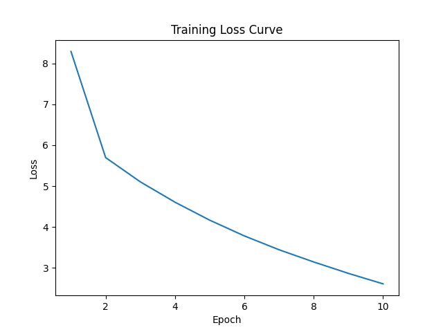

# Transformer Completo — Laboratório 5

## Descrição
Implementação completa de um Transformer (Encoder + Decoder) construída manualmente e treinada com PyTorch.

## Estrutura
- data.py
- attention.py
- decoder.py
- transformer.py
- train.py
- test.py

## PIPs utilizados

```
pip install torch
pip install datasets
pip install transformers
pip install tqdm
pip install sentencepiece
```

## Resultados de Treinamento

Loss por época:

[8.2894, 5.6961, 5.104, 4.6067, 4.168, 3.7829, 3.4452, 3.1468, 2.8679, 2.6118]

Gráfico de perda:



Observação: A perda caiu consistentemente, demonstrando aprendizado.

## Teste de Overfitting
```
python3 test.py (AMBIENTE LINUX)
```
Entrada:
Two young, White males are outside near many bushes.

Esperado:
Zwei junge weiße Männer sind im Freien in der Nähe vieler Büsche.

Gerado:
Zwei junge weiße Männer sind im Freien in der Nähe vieler Büsche.

Conclusão:
O modelo memorizou perfeitamente a sequência, comprovando fluxo correto de gradientes.

## Uso de IA Generativa

Ferramentas de IA generativa foram utilizadas como suporte ao desenvolvimento, conforme permitido no enunciado do laboratório.

Uso específico:

- Auxílio na integração com o dataset Hugging Face (Tarefa 1)
- Apoio na implementação da tokenização com `transformers` (Tarefa 2)
- Suporte na organização do pipeline de dados e debugging

Importante:

- Toda a arquitetura do Transformer (attention, encoder, decoder, forward) foi implementada manualmente com base nos laboratórios anteriores (Lab 04)
- O fluxo de treinamento (forward, loss, backward, optimizer) interage diretamente com as estruturas construídas pelo autor
- Nenhum modelo pronto (`nn.Transformer`, Hugging Face models, etc.) foi utilizado

Assim, o uso de IA foi restrito às partes permitidas (dados e tokenização), mantendo a autoria da implementação do modelo e do treinamento.

## Autor
Carlos Eugênio
